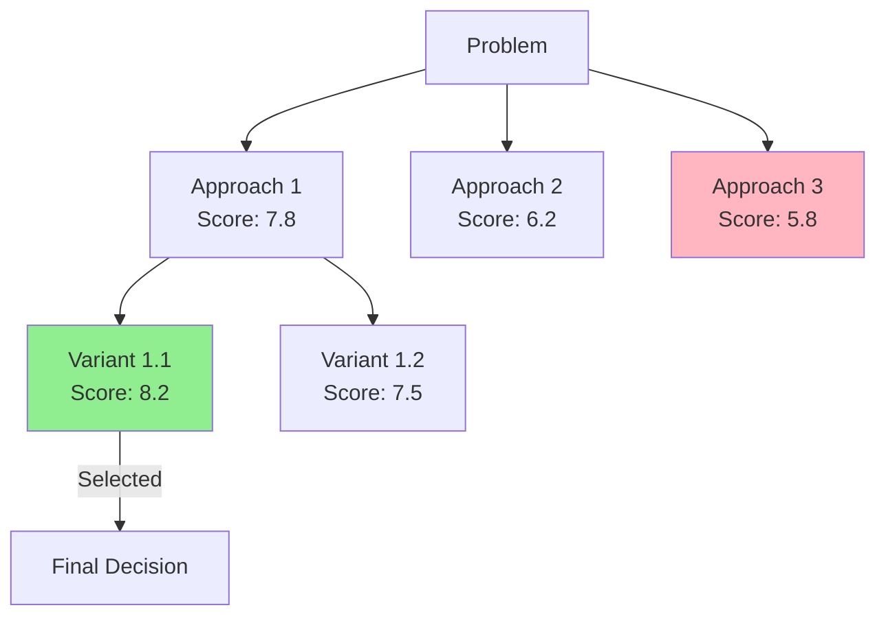

# Tree of Thoughts Pattern

**Typ**: Agent Pattern
**Confidence**: 90%
**Source**: Yao et al. (2023), "Tree of Thoughts: Deliberate Problem Solving with Large Language Models"
**Priority**: P1 - High

---

## Problem

Bei komplexen Entscheidungen mit mehreren Optionen:
- Erste Idee wird oft bevorzugt (Anchoring Bias)
- Alternativen werden nicht systematisch exploriert
- Tradeoffs werden nicht explizit verglichen
- Nicht-offensichtliche Lösungen werden übersehen

## Solution

Systematische Branch-Exploration mit Evaluation und Pruning:

```
Initial Problem
       │
       ▼
┌──────────────────┐
│    GENERATE      │
│  Create Branches │
│  (3-5 Options)   │
└────────┬─────────┘
         │
    ┌────┼────┬────┐
    ▼    ▼    ▼    ▼
  [B1] [B2] [B3] [B4]  ← Initial Branches
    │    │    │    │
    ▼    ▼    ▼    ▼
┌──────────────────┐
│    EVALUATE      │
│  Score Branches  │
│  (Rubric-based)  │
└────────┬─────────┘
         │
    ┌────┼────┐
    ▼    ▼    ▼
  [B1] [B2] [B4]  ← Pruned (B3 eliminated)
   8.2  7.5  6.8
    │
    ▼
┌──────────────────┐
│    EXPAND        │
│ Deepen Best (B1) │
│ Sub-branches     │
└────────┬─────────┘
         │
    ┌────┼────┐
    ▼    ▼    ▼
 [B1.1][B1.2][B1.3]  ← Sub-branches
    │    │    │
    ▼    ▼    ▼
┌──────────────────┐
│    SELECT        │
│ Best Overall Path│
│ with Justification│
└────────┬─────────┘
         │
         ▼
   Final Decision
   + Reasoning Trace
```

## Implementation

### Pydantic Models

```python
from pydantic import BaseModel, Field
from typing import Optional

class Branch(BaseModel):
    id: str
    parent_id: Optional[str] = None
    depth: int = 0
    description: str = Field(description="What this option entails")
    key_features: list[str] = Field(description="Main characteristics")
    assumptions: list[str] = Field(description="What must be true")
    risks: list[str] = Field(default_factory=list)

class EvaluationScore(BaseModel):
    feasibility: float = Field(ge=0, le=10, description="How implementable?")
    impact: float = Field(ge=0, le=10, description="Potential benefit?")
    risk: float = Field(ge=0, le=10, description="Risk level (inverted)")
    effort: float = Field(ge=0, le=10, description="Required effort (inverted)")
    alignment: float = Field(ge=0, le=10, description="Fits goals?")
    total: float = Field(description="Weighted total score")
    reasoning: str = Field(description="Evaluation rationale")

class TreeState(BaseModel):
    problem: str
    constraints: list[str]
    goals: list[str]
    branches: list[Branch]
    scores: dict[str, EvaluationScore]
    pruned: list[str]
    selected_path: list[str]
    final_decision: Optional[str] = None

class ToTConfig(BaseModel):
    initial_branches: int = Field(default=3, ge=2, le=5)
    max_branches: int = Field(default=5, ge=3, le=7)
    max_depth: int = Field(default=3, ge=1, le=5)
    pruning_threshold: float = Field(default=0.4, ge=0, le=1)
    expansion_threshold: float = Field(default=0.7, ge=0, le=1)
    weights: dict[str, float] = Field(default={
        "feasibility": 0.25,
        "impact": 0.25,
        "risk": 0.20,
        "effort": 0.15,
        "alignment": 0.15
    })
```

### Evaluation Rubric

```python
EVALUATION_RUBRIC = """
Score each criterion from 0-10:

**Feasibility** (0-10):
- 0-3: Requires unavailable resources/technology
- 4-6: Challenging but possible with effort
- 7-10: Straightforward to implement

**Impact** (0-10):
- 0-3: Minimal improvement over status quo
- 4-6: Moderate positive effect
- 7-10: Transformative improvement

**Risk** (0-10, inverted - high score = low risk):
- 0-3: High risk of failure/negative consequences
- 4-6: Moderate, manageable risks
- 7-10: Low risk, well-understood approach

**Effort** (0-10, inverted - high score = low effort):
- 0-3: Massive undertaking, months of work
- 4-6: Significant but bounded effort
- 7-10: Quick win, minimal effort

**Alignment** (0-10):
- 0-3: Conflicts with stated goals/values
- 4-6: Partially aligned
- 7-10: Perfect fit with objectives
"""

def calculate_weighted_score(scores: EvaluationScore, weights: dict) -> float:
    return (
        scores.feasibility * weights['feasibility'] +
        scores.impact * weights['impact'] +
        scores.risk * weights['risk'] +
        scores.effort * weights['effort'] +
        scores.alignment * weights['alignment']
    )
```

### LangGraph Flow

```python
from langgraph.graph import StateGraph, START, END
from typing import TypedDict

class ToTGraphState(TypedDict):
    problem: str
    constraints: list[str]
    goals: list[str]
    config: dict
    branches: list[dict]
    scores: dict
    current_depth: int
    selected_path: list[str]
    final_decision: str

def generate_node(state: ToTGraphState) -> dict:
    """Generate initial branches or expand existing ones."""

    if state['current_depth'] == 0:
        prompt = f"""
        Problem: {state['problem']}
        Constraints: {state['constraints']}
        Goals: {state['goals']}

        Generate {state['config']['initial_branches']} distinct approaches to solve this.
        Each approach should be fundamentally different, not variations of the same idea.

        For each approach, provide:
        - Clear description
        - Key features/characteristics
        - Assumptions it makes
        - Potential risks
        """
    else:
        best_branch = get_best_branch(state['branches'], state['scores'])
        prompt = f"""
        Expanding approach: {best_branch['description']}

        Generate {state['config']['initial_branches']} sub-variations or refinements.
        Consider:
        - Different implementation strategies
        - Alternative trade-offs
        - Hybrid approaches
        """

    branches = llm.with_structured_output(BranchList).invoke(prompt)

    return {
        "branches": state['branches'] + [b.dict() for b in branches.branches],
        "current_depth": state['current_depth'] + 1
    }

def evaluate_node(state: ToTGraphState) -> dict:
    """Score all unscored branches."""

    new_scores = {}
    for branch in state['branches']:
        if branch['id'] not in state['scores']:
            prompt = f"""
            {EVALUATION_RUBRIC}

            Evaluate this approach:
            {branch['description']}

            Key features: {branch['key_features']}
            Assumptions: {branch['assumptions']}
            Risks: {branch['risks']}

            Context:
            Problem: {state['problem']}
            Goals: {state['goals']}
            """

            score = llm.with_structured_output(EvaluationScore).invoke(prompt)
            score.total = calculate_weighted_score(score, state['config']['weights'])
            new_scores[branch['id']] = score.dict()

    return {"scores": {**state['scores'], **new_scores}}

def prune_node(state: ToTGraphState) -> dict:
    """Remove low-scoring branches."""

    threshold = state['config']['pruning_threshold']
    max_score = max(s['total'] for s in state['scores'].values())
    cutoff = max_score * threshold

    pruned_branches = [
        b for b in state['branches']
        if state['scores'].get(b['id'], {}).get('total', 0) >= cutoff
    ]

    return {"branches": pruned_branches}

def should_expand(state: ToTGraphState) -> str:
    """Decide whether to expand further or select."""

    if state['current_depth'] >= state['config']['max_depth']:
        return "select"

    best_score = max(s['total'] for s in state['scores'].values())
    if best_score >= state['config']['expansion_threshold'] * 10:
        return "select"  # Good enough, no need to expand

    if len(state['branches']) >= state['config']['max_branches']:
        return "select"

    return "expand"

def select_node(state: ToTGraphState) -> dict:
    """Select best path and generate final decision."""

    # Find best scoring branch
    best_id = max(state['scores'], key=lambda x: state['scores'][x]['total'])
    best_branch = next(b for b in state['branches'] if b['id'] == best_id)

    # Build path from root to best
    path = build_path_to_branch(state['branches'], best_id)

    prompt = f"""
    Based on systematic evaluation, recommend:

    Selected Approach: {best_branch['description']}
    Score: {state['scores'][best_id]['total']:.1f}/10

    Evaluation breakdown:
    {format_scores(state['scores'][best_id])}

    Alternatives considered:
    {format_alternatives(state['branches'], state['scores'], best_id)}

    Provide:
    1. Clear recommendation
    2. Key reasons for this choice
    3. Implementation considerations
    4. What to watch out for
    """

    decision = llm.invoke(prompt)

    return {
        "selected_path": path,
        "final_decision": decision.content
    }

# Build Graph
graph = StateGraph(ToTGraphState)
graph.add_node("generate", generate_node)
graph.add_node("evaluate", evaluate_node)
graph.add_node("prune", prune_node)
graph.add_node("select", select_node)

graph.add_edge(START, "generate")
graph.add_edge("generate", "evaluate")
graph.add_edge("evaluate", "prune")
graph.add_conditional_edges(
    "prune",
    should_expand,
    {"expand": "generate", "select": "select"}
)
graph.add_edge("select", END)

tot_chain = graph.compile()
```

## Output Format

### Decision Summary

```markdown
## Decision: [Selected Approach]

### Recommendation
[Clear, actionable recommendation]

### Evaluation Summary
| Criterion    | Score | Notes |
|--------------|-------|-------|
| Feasibility  | 8/10  | ...   |
| Impact       | 9/10  | ...   |
| Risk         | 7/10  | ...   |
| Effort       | 6/10  | ...   |
| Alignment    | 9/10  | ...   |
| **Total**    | **7.8/10** | |

### Alternatives Considered
1. **[Alternative A]** (6.2/10) - Not chosen because...
2. **[Alternative B]** (5.8/10) - Not chosen because...

### Implementation Notes
- Key first step: ...
- Watch out for: ...
- Success criteria: ...
```

### Visual Tree (Mermaid)



---

## Trade-offs

| Pro | Contra |
|-----|--------|
| Systematisch und nachvollziehbar | 2-4x Token-Verbrauch |
| Findet nicht-offensichtliche Lösungen | Aufwendig bei klaren Entscheidungen |
| Explizite Tradeoff-Dokumentation | Kann Analysis Paralysis fördern |
| Reduziert Anchoring Bias | Braucht klare Evaluationskriterien |
| Gut für Team-Entscheidungen | Overkill für triviale Choices |

## When to Use

- **JA**: Architektur-Entscheidungen, Technologie-Wahl, strategische Planung, komplexe Tradeoffs
- **NEIN**: Nur eine Option, einfache ja/nein Fragen, Zeitdruck, klare Best Practices

## Configuration

```json
{
  "initial_branches": 3,
  "max_branches": 5,
  "max_depth": 3,
  "pruning_threshold": 0.4,
  "expansion_threshold": 0.7,
  "weights": {
    "feasibility": 0.25,
    "impact": 0.25,
    "risk": 0.20,
    "effort": 0.15,
    "alignment": 0.15
  }
}
```

## Related Patterns

- [Reflection Pattern](reflection-pattern.md) - Für iterative Verbesserung
- [Task Decomposition](task-decomposition-pipeline.md) - Problem aufteilen
